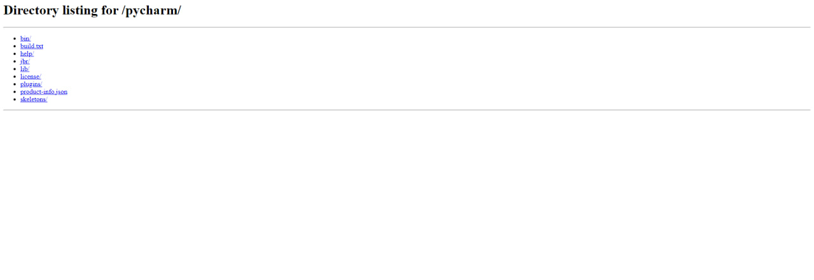

# Serv.Jarbou3-Http
New Type of malwares  this simple script will disable Firewall start http server  and forward the port of the server using ngrok will send you  the http server url in telegram_bot

# ScreenShot


## How To Use 
```bash
# Install dependencies 
$ python3 , pip
$ py -3 -m pip install -r Req.txt
# Building the payload

$ Replace the bot token And Chatid Cred in the file
$ Now compile the payload code using pyinstaller 
$ pyinstaller --noconfirm --onefile --windowed   payload.py 

```
